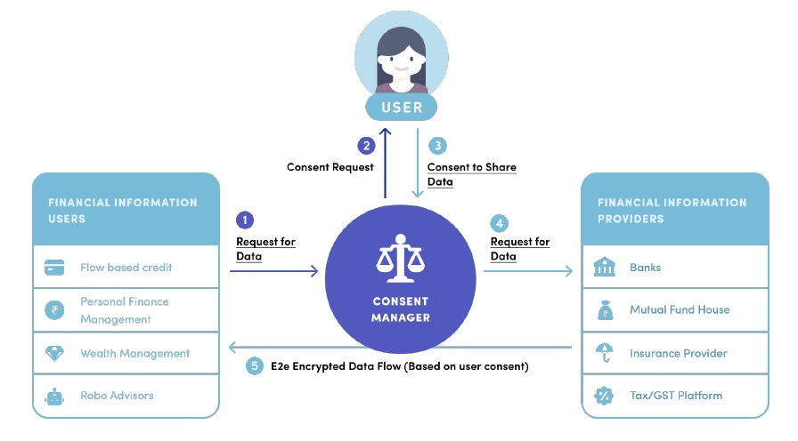

# Data Sharing in DEPA

Proposed in 2016, the Data Empowerment and Protection Architecture (DEPA) is a digital public good (DPG) which empowers data principals to share their data residing with one or more _data providers_ with _data consumers_ who wish to use data to provide services. In this architecture (which we refer to as the DEPA inference cycle), all data sharing in DEPA is mediated by fine-grained and timely consent. Data flows to data consumers only after clear and explicit consent has been obtained from the data principal. DEPA introduces an entity called the _Consent Manager_, which helps citizens manage and respond to consent requests. DEPA establishes standard data formats, APIs and protocols to simplify and streamline the process of obtaining reliable data, thereby facilitating more informed and real-time decision making such as determining which services to offer.

While DEPA to a large extent addresses the challenge of obtaining personal data, this data is purpose-limited. Its use is limited to offering a specific service for which consent was obtained. This data cannot be used or shared for other purposes such as analytics or training models. Therefore, organizations that wish to build better models remain constrained by lack of high quality training datasets. This is especially true for smaller organizations that do not have a sizeable user base of their own. For such organizations, the process of creating training datasets is both expensive, laborious, and time-consuming.

An alternative is to source data from other organizations. For example, advertisers can (and often do) source data from other providers to enrich their own datasets. A fintech that specializes in fraud detection could in theory source transaction data from financial institutions such as banks, credit bureaus, and payment gateways. But such ad-hoc data sharing arrangements often compromise user privacy, and lack transparency. Such arrangements are increasingly viewed with a lot of suspicion from regulators and the public at large. This has motivated a number of privacy laws such as HIPAA and GDPR which recognize each individual's right to privacy and require that organizations establish a legal basis before using or sharing personal data.

## Limits of Consent

In theory, it is possible to secure separate consent for analytics and training purposes. However, fine-grained consent is impractical in these scenarios for the several reasons.

- **Lack of direct benefit:** Data principals do not directly benefit from analytics and training. These tasks primarily benefit businesses, and in some cases, society at large. Consequently, unless appropriately incentivized, data principals are less likely to consent to the use of their data in such contexts (as shown by the change in [Apple's app tracking policy](https://www.bloomberg.com/news/articles/2022-11-17/iphone-data-changes-are-biggest-cause-of-meta-meta-woes?leadSource=uverify%20wall)).
- **Data lifetime considerations:** Analytics and training requires data to be used multiple times over a longer time period. For example, training a flow-based credit model requires a dataset of past borrowers and their profiles. This dataset is useful for training only when it has been labelled with additional information collected over time such as whether the borrower defaulted or not. This label may only be available a long time after the data was collected. Therefore, consent obtained at the time the data was first obtained is less meaningful.
- **Data aggregation:** Analytics and training often require data from multiple sources to be aggregated and joined. Consent collect at source should not be construed to allow arbitrary aggregation and joining with data from other sources since such operations can significantly compromise privacy.

## De-identification

For scenarios where consent is not practical, modern privacy laws permit alternative ways for establishing a legal basis for sharing and processing bulk data. It is possible to share and process _de-identified_ data **as long as the risk of re-identification has been minimized**. There are a number of de-identification techniques, e.g., data masking, PII-scrubbing, and k-anonymization.

Recently, real world studies have shown that user information can often be reverse engineered from de-identified datasets e.g, by correlating attributes in the dataset with additional data. A notable example is the the Netflix dataset which was released for research purposes. Subsequently, researchers demonstrated that it was possible to re-identify Netflix users from this dataset using auxiliary information available on the web.

These challenges highlight the intricacies of obtaining and utilizing consent for analytics and training, indicating that alternative approaches are necessary to balance the need for data-driven insights with the imperative of safeguarding privacy.

## Privacy-preserving Data Sharing

The challenges in data sharing have spurred the development of a number of _privacy enhancing technologies_ (PETs), which enable secure and private sharing of datasets. Among these technologies, a few have particularly matured over the last few years e.g., confidential computing, differential privacy, and distributed ledgers, and are finding applications at scale.

The DEPA training framework is designed to leverage these advanced technologies to establish a privacy-centric approach to bulk data collaboration. Its primary objective is to enable data collaboration that incorporates security, privacy and transparency by design, and unlock the full potential of data for artificial intelligence.
